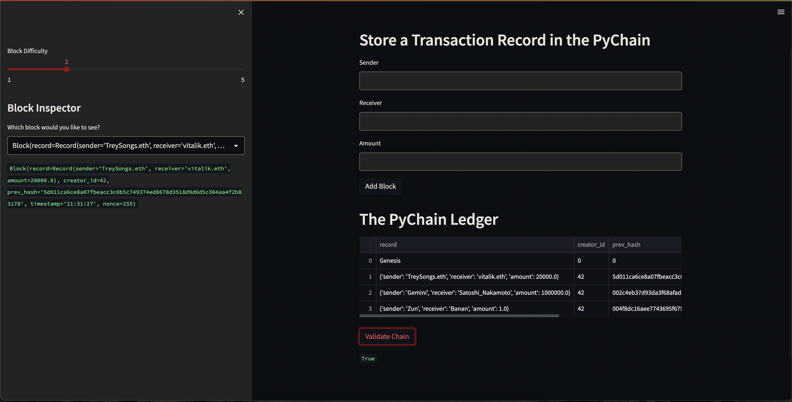

# PyChain Ledger

You’re a fintech engineer who’s working at one of the five largest banks in the world. You were recently promoted to act as the lead developer on their decentralized finance team. Your task is to build a blockchain-based ledger system, complete with a user-friendly web interface. This ledger should allow partner banks to conduct financial transactions (that is, to transfer money between senders and receivers) and to verify the integrity of the data in the ledger.

## The Application

Below is an image of the application in use. There is a form to record and submit the `Sender`, `Reciever` and `Amount` of the cryptocurrency. Below this we see a public ledger that along with the Genesis block, has recorded several other blocks for transactions. Below the ledger is a button to validate the chain. Once clicked, it will display `True` or `False` depending on the validity of the chain. In the image we see `True` in green text below the button, indicating that the chain is valid. On the left side of the application we see a slider to select the difficulty of tha chain's hash. Below this we have a dropdown to select a specific block from the chain ledger. And below that in green text we see the values of the block.

### Chain Validation

Below we can see that the `Validate Chain` button has been pressed. Below the button we can see `True` in green text, which is an output signifying that the chain is valid.

### Block Inspector

Below we see that block inspector outputting the values for the block, which were selected in the dropdown above it.

